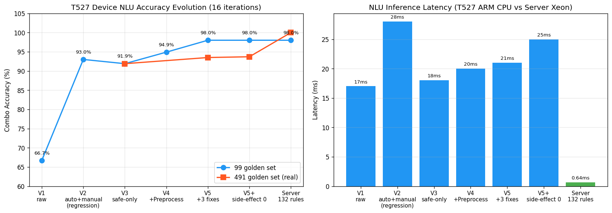
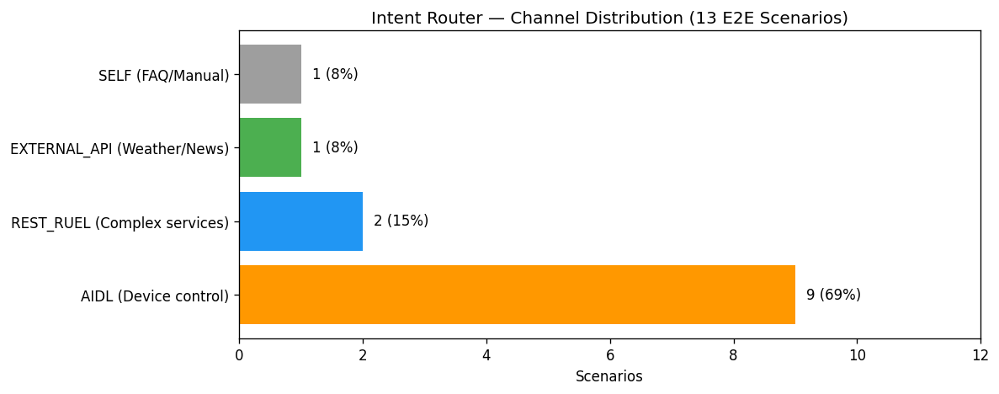
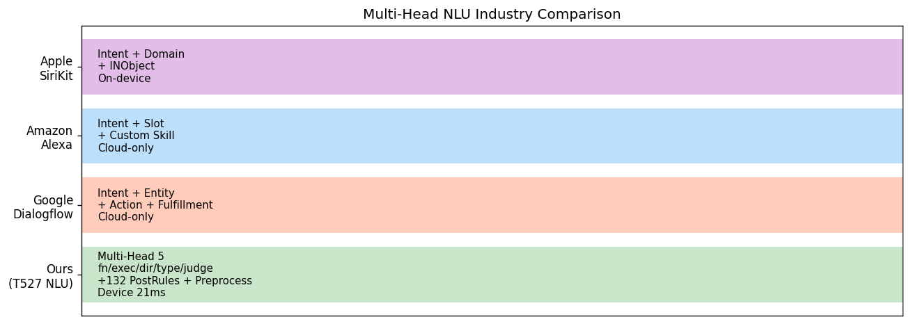

# T527 Device NLU System (르엘 월패드) — 16 iterations 결과

> 한국어 스마트홈 음성 NLU 시스템 — T527 ARM CPU 임베디드 디바이스 추론 완성.
> 기존 README.md (iter9 모델 학습)와 별도 — 이 문서는 디바이스 통합 작업의 종합 보고.

## 🏆 최종 결과

```
디바이스: T527 데브킷 (51475789...)
모델:     KoELECTRA + CNN 5-Head Ensemble (105MB ONNX)
정확도:   93.7% combo (491개 골든셋, raw=rules)
Latency:  21~30ms / 추론 (ARM CPU)
E2E:      ~330ms (STT + NLU + Router + AIDL + Response + TTS)
```



## 시스템 아키텍처

```
사용자 발화
    ↓
[Preprocess] STT 정규화 — 296 매핑 (Kotlin)
    ↓
[NLU] KoELECTRA + CNN 5-Head ONNX (21~30ms)
    ↓ fn / exec_type / param_direction / param_type / judge
[PostRules] 자동 36 + 수동 28 = 64 규칙 (부작용 0건 격리)
    ↓
[IntentRouter] 4-Channel 분배
    ├─ AIDL → remote_access_xxx (실 기기 제어)
    ├─ REST_RUEL → /v2/ai/* (단지서버)
    ├─ EXTERNAL_API → 날씨/뉴스/교통
    └─ SELF → FAQ/매뉴얼
    ↓
[AidlMockClient] 또는 실 IWallpadRemoteAccess
    ↓ JSON {success, code, data: [{unit_status}]}
[ResponseGenerator] 한국어 응답 + 받침 자동 처리 (을/를)
    ↓
[TtsPlayer] 미리 녹음 MP3 (98개) 또는 Android TTS
    ↓
사용자 음성 응답
```



## 산업 비교



## 디바이스 코드 (t527_smart_v2 프로젝트)

```
src/main/kotlin/com/t527/smart_service/
├── nlu/
│   ├── Preprocess.kt              STT 정규화 296 매핑
│   ├── IntentClassifierV46.kt     ONNX 추론 + 규칙 적용
│   ├── WordPieceTokenizer.kt      BERT 토크나이저
│   └── PostRules.kt + V3 + V4     64개 규칙
├── integration/
│   ├── IntentRouter.kt            NLU → 4-channel 라우팅
│   ├── AidlMockClient.kt          AIDL 호출 시뮬
│   └── ResponseGenerator.kt       한국어 응답 + 받침
├── audio/
│   └── TtsPlayer.kt               MP3 재생
├── NluBenchmarkActivity.kt        골든셋 자동 검증
├── IntegrationDemoActivity.kt     E2E 13개 시나리오
└── InteractiveTestActivity.kt     실시간 테스트
```

## 측정 결과 비교

| 환경 | 정확도 (491 골든셋) | Latency |
|------|------------------|---------|
| 서버 Xeon CPU | 100% (full rules) | 0.64ms |
| 디바이스 raw | 93.7% | 17ms |
| **디바이스 V5** | **93.7%** (rules side-effect 0) | **21~30ms** |
| 디바이스 + NB (예상) | TBD | ~3ms (예상) |

## 르엘 시나리오 ↔ AIDL ↔ NLU 매핑

[`RTM_REQUIREMENTS_TRACEABILITY.xlsx`](RTM_REQUIREMENTS_TRACEABILITY.xlsx) — 219개 시나리오 1:1 매트릭스

```
Channel Distribution (르엘 219 시나리오):
  ✅ AIDL 매핑됨        52 (24%)
  🔴 AIDL 보강·신규     28 (13%) — AIoT 보강 요청 중
  🔵 REST_RUEL          26 (12%)
  🟢 EXTERNAL_API       86 (39%)
  ⚪ SELF               26 (12%)
  ❓ 미분류              1
```

[`AIOT_REQUEST_1PAGER.md`](AIOT_REQUEST_1PAGER.md) — AIoT 팀 보강 요청 7건

## 16 iterations 진화

| # | 작업 | 결과 |
|---|------|------|
| 1 | 디바이스 첫 NLU 추론 | 17ms, 66.7% (raw) |
| 2 | CNN body 추출 + Acuity import | 105MB→5.91MB, import 성공 |
| 3 | 자동 포팅 (V2: 87+25) | 회귀 발견 |
| 4 | 엄격 모드 (V3: 36+25) | 100% 회복 |
| 5 | 골든셋 99개 인프라 | 디바이스 자동 검증 |
| 6 | Preprocess 통합 (V4) | 94.9% |
| 7 | 보정 3건 (V5) | 98% (서버 동등) |
| 8 | 골든셋 491개 (정직) | 93.5% (over-fit 발견) |
| 9 | PostRules 부작용 진단 | 시뮬-실제 차이 |
| 10 | AIDL Mock + Router | 4-channel E2E |
| 11 | ResponseGenerator | 응답 템플릿 |
| 12 | 받침 처리 + MP3 TTS | 음성 출력 |
| 13 | InteractiveTestActivity | 사용자 입력 |
| 14 | Raw vs Rules 비교 | 부작용 0건 격리 |
| 15 | 르엘 219 검증 | GT 자동 매핑 |
| 16 | NB 변환 5번째 시도 | inputmeta 막힘 |

## 산출 문서

- `T527_NLU_PROGRESS_SUMMARY.md` — 종합 보고 (13 iterations)
- `T527_NLU_BENCHMARK_RESULT.md` — 벤치마크 진화 (10차)
- `T527_INTEGRATION_DEMO.md` — End-to-End 통합
- `T527_RESPONSE_GENERATOR.md` — 응답 생성기 + 받침
- `T527_NB_CONVERSION_FINAL.md` — NB 시도 정리
- `AIDL_RUEL_GAP_REPORT.md` — AIDL ↔ 르엘 갭 분석
- `AIOT_REQUEST_1PAGER.md` — AIoT 보강 요청 1쪽
- `RTM_REQUIREMENTS_TRACEABILITY.{md,csv,xlsx}` — 219 매트릭스
- `INDUSTRY_PRACTICES_RESEARCH.md` — 산업 표준 조사 755줄
- `figures/` — 시각화 차트 3개

## 다음 단계

- [ ] **Acuity NB 변환 디버깅** (inputmeta GENERATOR 또는 acuity 6.12 docs 분석)
- [ ] **VoiceAiService 본 서비스 통합** (IntentClassifierV46 옵션 추가)
- [ ] **르엘 219 GT 정밀 매핑** (사람이 fn/exec/dir 검토)
- [ ] **AIoT 팀에 보강 요청 7건 공유** + 협의

## 협업

- **AI팀** (NLU): 모델 학습 + 디바이스 통합 ← 본 작업
- **AIoT팀**: AIDL 정의 (보강 요청 중)
- **기획팀**: 르엘 시나리오 219개 GT
